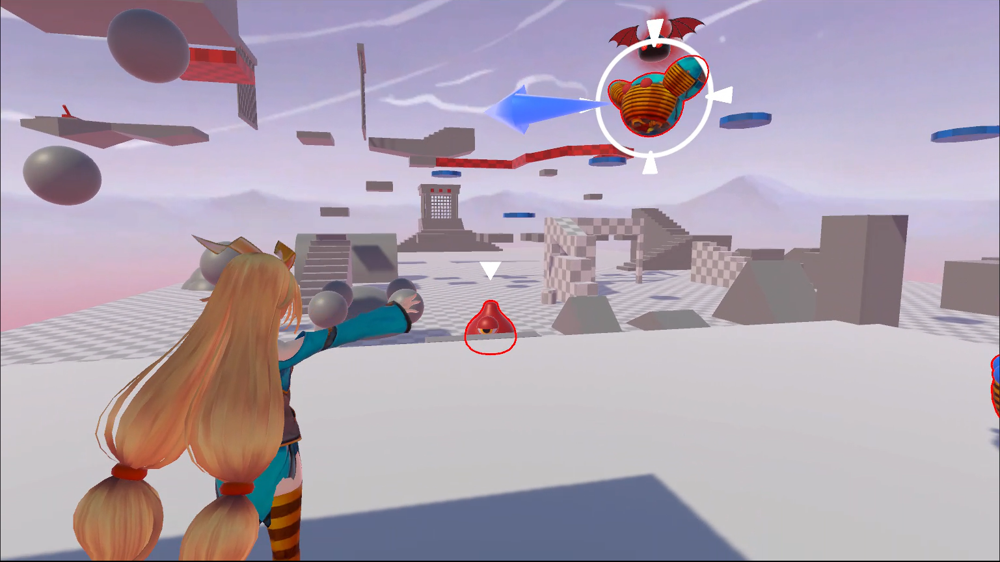

# The Hardest Dungeon
En cours de développement sur Unity 3D. Ce jeu n'est actuellement pas téléchargeable.

    

**Etat du projet :** Ce projet est loin d'être terminé et je travaille seul, cependant j'ai déjà appris beaucoup grâce à lui. Pour l'instant tout semble peut-être brouillon mais bientôt de vrais visuels et niveaux viendront s'y ajouter.

**Site web :** https://mauroyvictor.wixsite.com/website/currentproject

## **Description** 

**Univers :** Dans **The Hardest Dungeon**, vous devez simplement terminer un donjon qualifié d’impossible, rempli de pièges, de créatures maléfiques et gardé par une entité immortelle et invincible. « Simplement » me demandez-vous ? En effet, dans ce jeu vous incarnez les meilleurs aventuriers ayant jamais existé.

**Gameplay :** Déplacez-vous avez aisance dans les airs, projetez, culbutez ou écrasez vos ennemis afin de progresser dans ce jeu de plateformes en 3D.

## **Galerie d'images**

